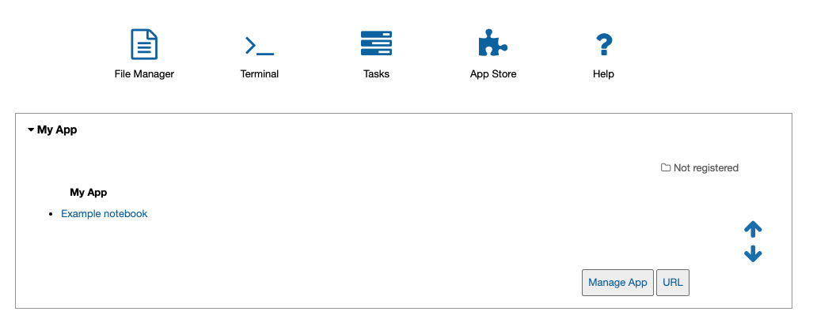

.. _develop-apps:create-app:

************************
Create your AiiDAlab app
************************

There are two approaches to develop a new AiiDAlab app:

.. panels::
   :body: bg-light
   :footer: bg-light border-0

   :fa:`bolt` App cutter

   The easiest and recommended approach is to create a new app with the :ref:`AiiDAlab app cookiecutter <develop-apps:create-app:variant-a_cookiecutter>`.

   ---

   :fa:`wrench` Step-by-step from scratch

   Of course, one can also create an app :ref:`step by step from scratch <develop-apps:create-app:variant-b_from-scratch>`.

.. _develop-apps:create-app:variant-a_cookiecutter:

Create app with cookiecutter
============================

Open the terminal from the AiiDAlab app start page by clicking on the "Terminal" :fa:`terminal` icon on the start page.

Then, execute the following steps:

.. code-block:: console

    ~$ cd apps
    ~/apps$ cookiecutter https://github.com/aiidalab/aiidalab-app-cutter.git
    app_name [my-app]:
    ...

After answering all questions posed by the cookiecutter, you will find a new folder inside the ``apps/`` directory that contains the basic scaffold structure for an AiiDAlab app.
The newly created app will also show up with a rendered banner on the start page after a reload:

     The start banner of the newly created app.

AiiDAlab expects that app source code is managed with `git <https://git-scm.com/>`__.
To start tracking the app development with git, within the terminal, execute:

.. code-block:: console

    ~$ cd apps/my-app/                              # enter the app directory
    ~/apps/my-app$ git init                         # initialize git repository
    ~/apps/my-app$ git add -A                       # add all files
    ~/apps/my-app$ git commit -m "initial commit"   # create initial commit

**Next:** :ref:`Learn how to use the AiiDAlab widgets library <develop-apps:widgets>`

.. _develop-apps:create-app:variant-b_from-scratch:

Create app from scratch (step-by-step)
======================================

Typically one would prefer to use the cookie-cutter to create a new app, but here are the steps to create an app from scratch.

.. panels::
   :container: container-lg pb-3
   :column: col-lg-12 p-2

   **Step 1: Create the app folder**

   Open the terminal by clicking on the "Terminal" :fa:`terminal` icon and then create a new app with:

   .. code-block:: console

       ~$ git init apps/my-app

   If you reloaded the start page, you would already see the banner of the app show up on the start page.

   .. _fig_app_development_new_app:

   .. figure:: include/new_app.png
       :scale: 60
       :align: center
       :alt: New app in home app.

       Newly created AiiDAlab app (missing app metadata).

   However, it is obvious that there are still a few things missing.

   ---

   **Step 2: Provide app metadata**

   To provide app metadata, we need to create a :file:`setup.cfg` file that contains basic information about the newly created app.

   You can create the file either with the Jupyter interface or directly in the terminal, e.g., with vim:

   .. tabbed:: Jupyter interface

      #. Open the file manager by clicking on the :fa:`file-alt` icon on the AiiDAlab start page.
      #. Click on "New" and then "Text file" to create a new file.
      #. Rename the file to :file:`setup.cfg` by clicking on :file:`untitled.txt` at the top and entering the new name.
      #. Copy the following snippet into the file and adjust it for your needs:

         .. code-block:: ini

             [aiidalab]
             title = My App

             [metadata]
             name = aiidalab-my-app
             version = 0.1-alpha
             author = J. Doe, G. Verdi
             description = A new AiiDAlab application that I just created.

      #. Save the file by clicking on "File" and then "Save".

   .. tabbed:: vim

      #. Open the terminal (:fa:`terminal`) and then start editing the :file:`setup.cfg` file with:

         .. code-block:: console

            $ cd ~/apps/my-app
            ~/apps/my-app$ vim setup.cfg

      #. Copy the following snippet and adjust it for your needs:

         .. code-block:: ini

             [aiidalab]
             title = My App

             [metadata]
             name = aiidalab-my-app
             version = 0.1-alpha
             author = J. Doe, G. Verdi
             description = A new AiiDAlab application that I just created.

   .. seealso::

       For more details about specifying metadata for your app, see :ref:`develop-apps:publish-app`.

   ---

   **Step 3: Add a logo**

   To add a logo for your app, simply add the URL to your logo file as a *project url* to the :file:`setup.cfg` metadata block.
   For example, if you submit the logo image file as part of your repository on GitHub, you could use a URL similar to:

   .. code-block::

       {
           [metadata]
           ...
           project_urls =
               Logo = https://raw.githubusercontent.com/aiidalab/aiidalab-hello-world/master/img/logo.png
       }

   The ``...`` is a placeholder for the previously added metadata.

   ---

   **Step 4: Add a start banner**

   The start banner is the widget that shows up on the AiiDAlab start page and that provides users the entry point to your app.
   You can create a static banner by adding :file:`start.md` file to the app directory, or a dynamic banner with a :file:`start.py` file.
   In the majority of cases you would want to create a static file, here is a minimal example:

   .. code-block:: md

       - [My App](./main.ipynb)

   Like the :file:`setup.cfg` file, you can either use the File Manager or the Terminal to create the file.

   .. note::

       The name of the notebook is arbitrary, but should of course match with the link.
       All paths are relative to the app's root directory (e.g. :file:`apps/my-app/`).

   ---

   **Step 5: Make the app functional**

   Creating a new app for AiiDAlab and making it show up on the start page is of course only the first step.
   Now we need to actually make it do something.

   In the previous step we created a link to a :file:`main.ipynb` file.
   However, that file does not exist yet, which you would have immediately noticed in case you tried to open it.

   Create the file by going back to the "File Manager" (navigate to :file:`apps/my-app` if needed), and then clicking on "New" and "Python 3".
   Rename the file to ``main`` and then add the following line into the first cell:

   .. code-block:: python

       print("Welcome to my app!")

   Save the notebook and close it.
   Now go back to AiiDAlab start page and click on the ``My App`` link again - it should bring you to a page that says "Welcome to my app!"

   In case you encounter any issues, compare your app to the source code of the `hello world app <https://github.com/aiidalab/aiidalab-hello-world>`_ that was templated by the cookiecutter approach.

   **Next:** :ref:`develop-apps:widgets`
