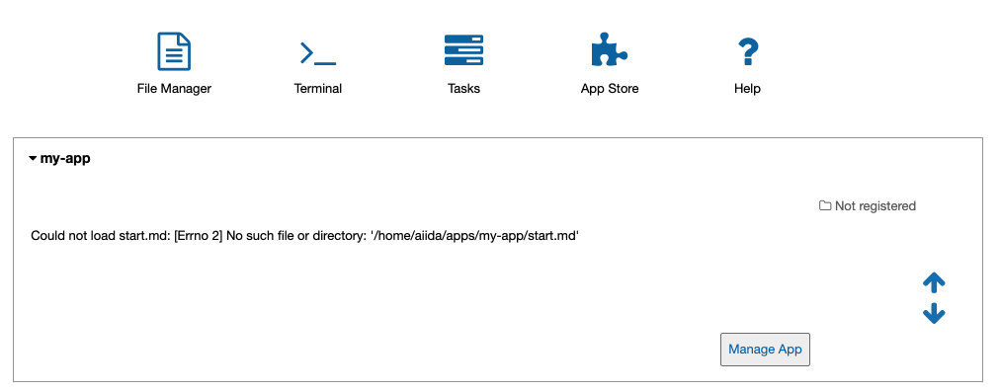

.. _develop-apps:create-app:

************************
Create your AiiDAlab app
************************

.. _develop-apps:create-app:variant-a_cookiecutter:

Variant A: Quickstart using the AiiDAlab app cookiecutter
=========================================================

Open the terminal from the AiiDAlab start page by clicking on the icon labeled "Terminal":
Then in the terminal, type:

.. code-block:: console

    ~$ cd apps
    ~/apps$ cookiecutter https://github.com/aiidalab/aiidalab-app-cutter.git
    app_name [template]:
    ...

After answering the questions asked by the app-cutter, you will find a new folder inside the *apps* directory that contains the basic structure of an app.
The newly created app will show up with a rendered banner on the start page after a reload.

.. note::

    AiiDAlab expects that app source code is managed with `git <https://git-scm.com/>`__.
    To start tracking the app development with git, open the terminal once more, and execute:

    .. code-block:: console

        ~$ cd apps/my-app/                              - enter the app directory
        ~/apps/my-app$ git init                         - initialize git repository
        ~/apps/my-app$ git add -A                       - add all files
        ~/apps/my-app$ git commit -m "initial commit"   - create initial commit

**Next:** :ref:`develop-apps:widgets`

.. _develop-apps:create-app:variant-b_from-scratch:

Variant B: Create app from scratch (step-by-step)
=================================================

Typically one would prefer to use the cookie-cutter to create a new app, but here are the steps to create an app from scratch.

Step 1: Create the app folder
-----------------------------

Open the terminal and then create a new app with:

.. code-block:: console

    ~$ git init apps/my-app

After this, just update the home page and you will see that your new app is already there!
However, it is obvious that there are still a few essential things missing: specifically the app metadata including a title and description.

.. _fig_app_development_new_app:

    Newly created AiiDAlab app (still missing app metadata).

Step 2: Add ``metadata.json`` file
----------------------------------

We need to create a file called :file:`metadata.json` that contains some basic information about our newly created app.
You can create the file either in the terminal, e.g., with ``vim``, or directly through the Jupyter interface.
For the latter:

#. Open the AiiDAlab start page.
#. Click on the "File Manager" icon in the top left corner and navigate to the :file:`apps/my-app` folder.
#. Click on "New" and then "Text file" to create a new file.
#. Rename the file to "metadata.json" by clicking on "untitled.txt" at the top and entering "metadata.json".
#. Copy the following snippet into the file and adjust it for your needs:

   .. code-block:: json

       {
           "title": "Example App",
           "description": "Example app that I just created",
           "authors": "X.Y. Author1, A.B. Author2"
       }

#. Save the file by clicking on "File" and then "Save".

To add a logo for your app, place the logo file within the app directory and add the filename to the :file:`metadata.json` file:

.. code-block::

    {
        ...
        "logo": "logo.png"
    }

The ``...`` is a placeholder for the previously added metadata.

Step 3: Add a start banner
--------------------------

The start banner is the widget that shows up on the AiiDAlab start page and that users are expected to click on to start the app.
You can create a static banner by adding :file:`start.md` file to the app directory, or a dynamic banner with a :file:`start.py` file.
In the majority of cases you would want to create a static file, here is a minimal example:

.. code-block:: md

    - [My App](./main.ipynb)

Like the :file:`metadata.json` file, you can either use the File Manager or the Terminal to create the file.

.. note::

    The name of the notebook is arbitrary, but should of course match with the link.
    All paths are relative to the app's root directory (e.g. :file:`apps/my-app/`).

Step 4: Make the app functional
-------------------------------

Creating a new app for AiiDAlab and making it show up on the start page is of course only the first step.
Now we need to actually make it do something.

In the previous step we created a link to a :file:`main.ipynb` file.
However, that file does not exist yet, which you would have immediately noticed in case you tried to open it.

Create the file by going back to the "File Manager" (navigate to :file:`apps/my-app` if needed), and then clicking on "New" and "Python 3".
Rename the file to ``main`` and then add the following line into the first cell:

.. code-block:: python

    print("Welcome to my app!")

Save the notebook and close it.
Now go back to AiiDAlab start page and click on the ``My App`` link again - it should bring you to a page that says "Welcome to my app!"

In case you encounter any issues, compare your app to the source code of the `hello world app <https://github.com/aiidalab/aiidalab-hello-world>`_ that was templated by the cookiecutter approach.

**Next:** :ref:`develop-apps:widgets`
