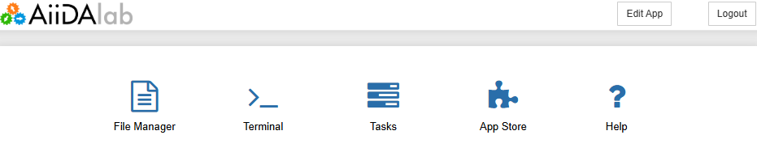

.. _aiidalab-home:

******************
AiiDAlab Home page
******************

When you first open AiiDAlab in the browser, you will arrive at the AiiDAlab home app.

Here you will find the following features:

- :fa:`file-alt fa-fw` **File manager**: manage files stored in the AiiDAlab home folder (including download/upload)
- :fa:`terminal fa-fw` **Terminal**: a standard Linux bash terminal
- :fa:`tasks fa-fw` **Tasks**: view/manage running applications (and stop them if needed)
- :fa:`puzzle-piece fa-fw` **App Store**: install/update/remove applications
- :fa:`question fa-fw` **Help**: links to the AiiDAlab documentation
